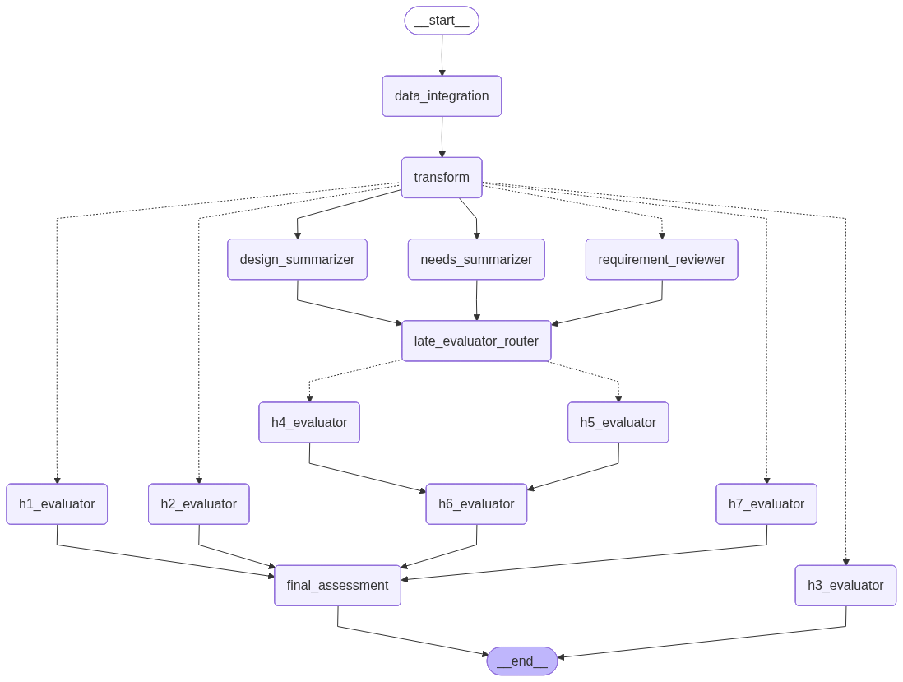

# Hazard Risk Reviewer

QAAI (qaai) · qaai.agents.hazard_risk_reviewer · endpoint POST /api/v1/hazard-risk-review · generated from the codebase 2026-07-20

<h2 id="purpose">What it checks &amp; how</h2>

The Hazard Risk Reviewer evaluates a single hazard record from a Software Hazard Analysis (SHA) and asks whether its traced requirements, test cases, and design controls provide **reasonable assurance of safety** against that hazard, per ISO 14971 / IEC 62304. It applies a seven-dimension rubric (H1–H6 mandatory + R7 recommended) and emits a binary Yes/No `overall_verdict` computed deterministically from the seven findings. Each finding also carries a `partial` flag: a partial-Yes (`verdict="Yes"`, `partial=true`) means the criterion is met but coverage is materially incomplete, rendered **Yellow** for reviewer attention. A partial-Yes still passes the verdict and is intentionally unscored by the eval harness (mirrors the test_case_reviewer's checklist `partial`).

Its defining feature: for every requirement traced from the hazard, it **invokes the entire Test Suite (RTM) reviewer as a subgraph** — so each risk-control requirement gets a full coverage review, and those results feed the risk-control / verification dimensions.

<h2 id="inputs">Inputs required</h2>

The graph state is `HazardReviewState` hazard_risk_reviewer/core.py. The API parses an uploaded SHA Excel file into one `HazardRowWithTraceMatrix` per row:

<table>
<thead><tr><th>Field</th><th>Type</th><th>Required</th><th>Meaning</th></tr></thead>
<tbody>
<tr><td><code>hazard</code></td><td><code>HazardRowWithTraceMatrix</code></td><td>Yes</td><td>The SHA row (hazard, hazardous situation, causes, pre/post-mitigation risk, controls) plus its trace matrix. <code>hazard_id</code> is the cache partition.</td></tr>
<tr><td> ↳ <code>requirements_traceability</code></td><td><code>HazardTraceMatrix</code></td><td>—</td><td>Traced <code>requirements</code>, <code>test_cases</code>, <code>design_docs</code>, <code>user_needs</code>, <code>system_requirements</code>.</td></tr>
<tr><td><code>cache_mode</code></td><td><code>"off" | "on" | "test"</code></td><td>Optional</td><td>Per-run cache behaviour; defaults to <code>on</code> (legacy <code>partial</code>→<code>on</code>, <code>full</code>→<code>test</code> still accepted).</td></tr>
<tr><td><code>pyjama_request</code></td><td><code>PyJamaRequest</code></td><td>Optional</td><td>When present, a JAMA <code>bidirectional_trace</code> fetch merges traceability onto the row; absent → Excel-only.</td></tr>
</tbody></table>

API form fields: `project_name`, the `.xlsx` file, `sheet_name` (default `SHA Table`), `identifier_pattern` (default `GID-\d+`; passed to the loader as `extract_gids_format`), `cache_mode`, `use_cache`, `test_mode`, `include_edge_case_analysis`, and `include_design_summaries` (gates the embedded RTM's `design_summarizer` branch; see [Configuration → Caching](../configuration.html#caching)). See the full field table in the [API Guide](../api.html#hazard).

<h2 id="graph">Graph topology</h2>

<figure>
  
  <figcaption>Compiled <code>HazardReviewerRunnable</code> graph. H1/R7 run early; H2/H3 dispatch off the design summarizer; H4/H5 after the requirement reviews + summaries; H6 after H4/H5; the final assessor joins all seven. <em>The ASCII below is authoritative; the rendered PNG is regenerated separately (follow-up).</em></figcaption>
</figure>

<pre class="diagram"><code>START
  -&gt; data_integration -&gt; transform -&gt; validation_gate   (skip -&gt; END when required SHA fields are missing)
  -&gt; work_router
       |-- dispatch_hazard_evaluators_early --&gt; [ h1 | r7 ]          (need only hazard fields)
       |-- dispatch_requirement_reviews -- Send xN --&gt; requirement_reviewer  (each runs the RTM subgraph)
       |-- design_summarizer                                        (parallel)
       |-- needs_summarizer                                         (parallel)
  design_summarizer -- dispatch_hazard_evaluators_design --&gt; [ h2 | h3 ]   (consume summarized_designs)
  [ requirement_reviewer | design_summarizer | needs_summarizer ]
       \--&gt; late_evaluator_router
                -- dispatch_hazard_evaluators_late --&gt; [ h4 | h5 ]  (parallel)
                         \--&gt; h6_evaluator   (waits for h4 + h5; H3 finding arrives via reducer)
  -&gt; final_assessment   (joins h1, h2, h6, r7; H3/H4/H5 already reduced)  -&gt; END</code></pre>

Findings accumulate into `hazard_findings` via an `Annotated[List[HazardFinding], operator.add]` reducer; per-requirement RTM results accumulate into `requirement_reviews` the same way. hazard_risk_reviewer/pipeline.py

<h2 id="staging">Why the graph is staged by data dependency</h2>

- **H1, R7** only read hazard fields, so they fire immediately from `work_router`, in parallel with the requirement reviews and summarizers.
- **H2 (software contribution)** and **H3 (pre-mitigation risk)** reason over the summarized design controls, so they dispatch off `design_summarizer` once it completes — not from `work_router`.
- **H4 (risk-control coverage)** and **H5 (verification depth)** need the per-requirement RTM results *and* the design/needs summaries, so they wait behind `late_evaluator_router` (which joins `requirement_reviewer` + both summarizers).
- **H6 (residual-risk closure)** depends on H3, H4, H5. It is wired only behind H4+H5 (same superstep); H3's finding is already in the reducer by then (H3 runs no later than `late_evaluator_router`), so no direct H3→H6 edge is needed (one would fire H6 a superstep early).
- **final_assessment** waits for all seven findings.

<h2 id="subgraph">Embedded RTM subgraph</h2>

`RequirementReviewerNode` wraps a compiled `RTMReviewerRunnable` and invokes it once per traced requirement (fanned out via `Send`). The whole RTM result is cached as one blob keyed on `req_id` — so a requirement appearing in several hazard rows is reviewed at most once per prompt version. On a blob-cache hit the RTM subgraph is **skipped entirely**; on a miss the subgraph runs and its own node-level caching applies too, because the embedded RTM shares the hazard reviewer's `cache_manager` — it is not a separate, uncached instance hazard_risk_reviewer/nodes.py:330-405. That includes the RTM `design_summarizer`'s per-item, `doc_id`-keyed cache (see [Caching → Per-item design-doc summaries](caching.html#peritem)), so a design doc cited by both a standalone RTM run and a hazard row's embedded subgraph is summarized once and reused by both. The embedded subgraph is invoked with the parent hazard run's `cache_mode` unchanged — it is never forced into a different mode.

The embedded RTM uses the hazard reviewer's prompt set, so the
"Include Edge Case Analysis" toggle flows through to the per-requirement coverage
review (v4 edge-case decomposer when ON, v3 baseline when OFF).

<h2 id="nodes">Nodes &amp; prompts</h2>

<table>
<thead><tr><th>Node</th><th>Class</th><th>Prompt role</th><th>Does</th><th>Output</th></tr></thead>
<tbody>
<tr><td><code>data_integration</code> / <code>transform</code></td><td><code>DataIntegrationNode</code> / fn</td><td>—</td><td>Optional JAMA bidirectional-trace fetch + merge onto the hazard (no-ops for Excel-only rows).</td><td>state fields</td></tr>
<tr><td><code>h1_evaluator</code></td><td><code>HazardEvaluatorNode</code></td><td><code>hazard_h1</code></td><td>Hazard record completeness &amp; semantic integrity.</td><td><code>HazardFinding</code></td></tr>
<tr><td><code>h2_evaluator</code></td><td><code>HazardEvaluatorNode</code></td><td><code>hazard_h2</code></td><td>Software contribution &amp; cause coverage.</td><td><code>HazardFinding</code></td></tr>
<tr><td><code>h3_evaluator</code></td><td><code>HazardEvaluatorNode</code></td><td><code>hazard_h3</code></td><td>Pre-mitigation risk &amp; exploitability characterization.</td><td><code>HazardFinding</code></td></tr>
<tr><td><code>requirement_reviewer</code></td><td><code>RequirementReviewerNode</code></td><td>(RTM subgraph)</td><td>Runs the full RTM reviewer per traced requirement; cached per <code>req_id</code>.</td><td><code>RequirementReview[]</code></td></tr>
<tr><td><code>design_summarizer</code></td><td><code>HazardDesignSummarizerNode</code> (Batched)</td><td><code>hazard_design_summarizer</code></td><td>Summarizes design controls.</td><td><code>HazardSummarizedDesignSpec[]</code></td></tr>
<tr><td><code>needs_summarizer</code></td><td><code>HazardNeedsSummarizerNode</code> (Batched)</td><td><code>hazard_needs_summarizer</code></td><td>Summarizes user needs.</td><td><code>HazardSummarizedUserNeed[]</code></td></tr>
<tr><td><code>h4_evaluator</code></td><td><code>HazardEvaluatorNode</code></td><td><code>hazard_h4</code></td><td>Risk-control identification, allocation &amp; coverage (uses req-reviews + designs).</td><td><code>HazardFinding</code></td></tr>
<tr><td><code>h5_evaluator</code></td><td><code>HazardEvaluatorNode</code></td><td><code>hazard_h5</code></td><td>Verification depth &amp; hazard-path effectiveness. <em>N-A</em> when there is no software cause.</td><td><code>HazardFinding</code></td></tr>
<tr><td><code>h6_evaluator</code></td><td><code>H6EvaluatorNode</code></td><td><code>hazard_h6</code></td><td>Residual-risk closure &amp; acceptability (joins H3/H4/H5).</td><td><code>HazardFinding</code></td></tr>
<tr><td><code>r7_evaluator</code></td><td><code>HazardEvaluatorNode</code></td><td><code>hazard_r7</code></td><td>HSHA update &amp; newly identified hazard capture (recommended; non-gating).</td><td><code>HazardFinding</code></td></tr>
<tr><td><code>final_assessment</code></td><td><code>_FinalAssessorNode</code> (final)</td><td><code>hazard_final_assessor</code></td><td>Assembles the seven findings; the verdict is computed in code, the LLM writes the prose.</td><td><code>HazardAssessment</code></td></tr>
</tbody></table>

<h2 id="rubric">Rubric — H1–H6 (mandatory) + R7 (recommended)</h2>

<table>
<thead><tr><th>Code</th><th>Dimension</th><th>Verdict</th><th>N-A rule</th></tr></thead>
<tbody>
<tr><td><strong>H1</strong></td><td>Hazard record completeness &amp; semantic integrity</td><td>Yes / No</td><td>—</td></tr>
<tr><td><strong>H2</strong></td><td>Software contribution &amp; cause coverage</td><td>Yes / No</td><td>—</td></tr>
<tr><td><strong>H3</strong></td><td>Pre-mitigation risk &amp; exploitability characterization</td><td>Yes / No</td><td>—</td></tr>
<tr><td><strong>H4</strong></td><td>Risk-control identification, allocation &amp; coverage</td><td>Yes / No</td><td>—</td></tr>
<tr><td><strong>H5</strong></td><td>Verification depth &amp; hazard-path effectiveness</td><td>Yes / No / N-A</td><td><em>N-A</em> when <code>software_related_causes</code> is empty (no software contribution).</td></tr>
<tr><td><strong>H6</strong></td><td>Residual-risk closure &amp; acceptability decision</td><td>Yes / No</td><td>—</td></tr>
<tr><td><strong>R7</strong> <em>(recommended)</em></td><td>HSHA update &amp; newly identified hazard capture</td><td>Yes / No</td><td>Recommended only — excluded from <code>overall_verdict</code>.</td></tr>
</tbody></table>

<strong>Partial (Yellow) signal.</strong> Every finding also carries a boolean <code>partial</code> flag. Set with <code>verdict="Yes"</code>, it marks a criterion that is met but whose coverage/evidence is materially incomplete — rendered Yellow in the viewer for reviewer attention. <code>partial</code> is legal only with <code>Yes</code> (never <code>No</code>/<code>N-A</code>), a partial-Yes still passes <code>overall_verdict</code>, and it is intentionally left unscored by the eval harness (the scorer reads only the binary verdict). This mirrors the test_case_reviewer's <code>EvaluatedReviewObjective.partial</code>.

<h2 id="verdict">Verdict logic</h2>

The `final_assessment` node returns exactly seven `HazardFinding` items (H1–H6 mandatory + R7 recommended). The verdict is computed **deterministically in code**, not by the LLM: `overall_verdict` is **Yes** iff every **mandatory** finding (H1–H6) verdict is in `{Yes, N-A}`, else **No**. **R7 is recommended only and is excluded from the verdict** — an R7 = No never flips it (mirrors the RTM reviewer's R6 advisory criterion). A `partial`-Yes finding has `verdict="Yes"`, so it passes here unchanged — `partial` is a Yellow reviewer-attention signal, never a gate. The LLM is used only to write the accompanying `comments` and `clarification_questions`; if the prose call fails, the deterministic assessment is still produced. hazard_risk_reviewer/nodes.py

<h2 id="cache">Caching &amp; prompt sets</h2>

The hazard reviewer's own nodes (H1–H6, R7, summarizers) and the per-requirement RTM blobs use the shared `ReviewCacheManager` — the H-nodes partition by `hazard_id` (`HAZ-*`), the RTM blobs by `req_id` (`REQ-*`).

<strong>Prompt sets &amp; the edge-case toggle.</strong> When
<code>include_edge_case_analysis</code> is ON the embedded RTM (and the RTM blob
cache) use <code>test_suite_reviewer_v4</code>; OFF uses
<code>test_suite_reviewer_v3</code>. The prompt-set name is folded into the cache
key, so v3 and v4 hazard runs never reuse each other's RTM blobs even though their
synthesizer version is identical. Two hazard graphs (one per set) are pre-compiled
at startup and selected per request.

## Output

The endpoint returns a self-contained HTML viewer rendered from `outputs.jsonl`, one record per hazard row, showing the H1–H6 + R7 rubric, the per-requirement RTM reviews, and the deterministic overall verdict.
