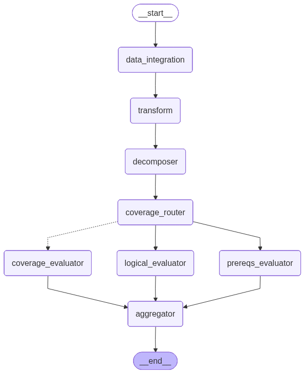

# Test Case Reviewer

QAAI (qaai) · qaai.agents.test_case_reviewer · endpoint POST /api/v1/test-case-review · generated from the codebase 2026-07-06

<h2 id="purpose">What it checks &amp; how</h2>

Where the RTM reviewer asks "does the *suite* cover the requirement?", the Test Case Reviewer zooms in on a **single test case** and asks "is *this* test case well-formed and adequate for the requirement(s) it traces to?" It evaluates the test case along three independent axes and reduces them to a 5-row checklist with a binary Yes/No `overall_verdict`.

It makes its assessment by:

1. **Decomposing** each traced requirement into atomic specs (sequentially, one LLM call per requirement).
2. Evaluating, in parallel, three axes: **coverage** (per spec — does the test case exercise it?), **logical structure** (test-case-level — do the steps flow sensibly?), and **prerequisites** (test-case-level — are setup and preconditions clear and sufficient?).
3. **Aggregating** the three axes against the configurable review-objectives checklist into a `TestCaseAssessment`.

<h2 id="inputs">Inputs required</h2>

The graph state is `TCReviewState` test_case_reviewer/core.py. A run needs, per test case:

<table>
<thead><tr><th>Field</th><th>Type</th><th>Required</th><th>Meaning</th></tr></thead>
<tbody>
<tr><td><code>test_case</code></td><td><code>TestCase</code></td><td>Yes</td><td>The single test case under review (id, description, setup, steps, expected results). <code>test_id</code> is the cache partition.</td></tr>
<tr><td><code>requirements</code></td><td><code>List[Requirement]</code></td><td>Yes</td><td>One or more requirements the test case traces to.</td></tr>
<tr><td><code>design_docs</code></td><td><code>List[DesignDocument]</code></td><td>Accepted (unused)</td><td>Accepted on the state and defaulted to empty by the service, but <strong>not consumed by any node or prompt</strong> in this reviewer — it does not affect the verdict. (Design context <em>is</em> used by the test-suite and hazard reviewers, not here.)</td></tr>
<tr><td><code>cache_mode</code></td><td><code>"off" | "on" | "test"</code></td><td>Optional</td><td>Per-run cache behaviour; defaults to <code>on</code>. Legacy <code>partial</code>/<code>full</code> map to <code>on</code>/<code>test</code>.</td></tr>
</tbody></table>

<strong>Note — <code>design_docs</code> is currently inert here.</strong> Although the field is on <code>TCReviewState</code> and the service passes it through, no test-case-reviewer node reads it and none of its prompts reference design specifications. It is retained as a placeholder aligned with the test-suite and hazard reviewers (which <em>do</em> consume design context).

<h2 id="graph">Graph topology</h2>

<figure>
  
  <figcaption>Compiled <code>TCReviewerRunnable</code> graph (rendered from the live pipeline).</figcaption>
</figure>

<pre class="diagram"><code>START
  -&gt; data_integration -&gt; transform -&gt; validation_gate
  -&gt; coverage_router
       |-- dispatch_requirement_pipeline --Send xN--&gt; requirement_pipeline  (parallel, per requirement)
       |        each: decompose one requirement, then cover its specs concurrently
       |-- (direct edge) ----------------------------&gt; logical_evaluator     (test-case-level)
       |-- (direct edge) ----------------------------&gt; prereqs_evaluator     (test-case-level)
  -&gt; aggregator                   (reduces all three axes)
  -&gt; END</code></pre>

From `coverage_router` the graph fans out three ways at once. In **decomposition mode** the requirement axis fans *per requirement* via `Send` to the fused `requirement_pipeline` node, which decomposes that one requirement and then runs coverage for its specs — so requirement A's coverage overlaps requirement B's decomposition (no barrier on the slowest decomposition). Both `decomposed_requirements` and `coverage_analysis` are accumulated by `operator.add`. The logical and prereqs axes are single test-case-level nodes reached by direct edges. All converge on the aggregator. (No-decomposition mode instead fans out per requirement to a single `coverage_evaluator` with no decomposition stage.) test_case_reviewer/pipeline.py

<h2 id="nodes">Nodes &amp; prompts</h2>

<table>
<thead><tr><th>Node</th><th>Class</th><th>Prompt role</th><th>Does</th><th>Output</th></tr></thead>
<tbody>
<tr><td><code>data_integration</code> / <code>transform</code></td><td><code>DataIntegrationNode</code> / fn</td><td>—</td><td>Conditional JAMA fetch + map to state (no-ops locally).</td><td>state fields</td></tr>
<tr><td><code>coverage_router</code></td><td><code>lambda</code></td><td>—</td><td>Single named source for the 3-way fan-out.</td><td>—</td></tr>
<tr><td><code>requirement_pipeline</code> <em>(decomp mode)</em></td><td><code>RequirementCoveragePipelineNode</code> (composes <code>DecomposerNode</code> + <code>SingleSpecCoverageNode</code>)</td><td><code>decomposer</code> + <code>single_test_coverage_eval</code></td><td>Per requirement (parallel via <code>Send</code>): decompose that requirement into specs, then cover its specs concurrently. Fusing the two stages overlaps coverage with the other requirements' decomposition.</td><td><code>DecomposedRequirement</code> + <code>SpecAnalysis[]</code> (both accumulated)</td></tr>
<tr><td><code>coverage_evaluator</code> <em>(no-decomp mode)</em></td><td><code>SingleReqCoverageNode</code></td><td><code>single_test_coverage_eval</code></td><td>Per requirement: does this test case exercise the requirement? Runs N× in parallel via <code>Send</code>.</td><td><code>SpecAnalysis</code> (accumulated)</td></tr>
<tr><td><code>logical_evaluator</code></td><td><code>OverallLogicalNode</code></td><td><code>single_test_logical_steps</code></td><td>Test-case-level: do steps follow a logical setup→verification flow?</td><td><code>OverallAnalysis</code></td></tr>
<tr><td><code>prereqs_evaluator</code></td><td><code>OverallPrereqsNode</code></td><td><code>single_test_prereqs</code></td><td>Test-case-level: are environment/prerequisites clear and sufficient?</td><td><code>OverallAnalysis</code></td></tr>
<tr><td><code>aggregator</code></td><td><code>AggregatorNode</code> (final)</td><td><code>single_test_aggregator</code></td><td>Reduces the three axes against the review objectives into the 5-row checklist. <code>is_final_output=True</code>.</td><td><code>TestCaseAssessment</code></td></tr>
</tbody></table>

<h2 id="axes">The three axes</h2>

The split reflects what is per-spec vs. test-case-wide:

- **Coverage** is per spec — a test case may cover some specs and miss others — so it fans out one evaluation per decomposed spec.
- **Logical structure** and **prerequisites** are properties of the whole test case, so each is a single LLM call returning one `OverallAnalysis` (no per-spec iteration).

<h2 id="rubric">Review objectives (the 5-row checklist)</h2>

Embedded directly in the `single_test_aggregator` prompt (v8 for the decomposition set, v9 for the no-decomposition set) rather than supplied as graph input — matching how the test-suite (M1-M5) and hazard (H1-H6) reviewers carry their rubrics in-prompt. The `mandatory` flag decides whether a "No" gates the verdict.

<table>
<thead><tr><th>id</th><th>Checks</th><th>Mandatory?</th></tr></thead>
<tbody>
<tr><td><code>expected_result_support</code></td><td>Expected results include sufficient evidence to prove outcomes.</td><td>Yes</td></tr>
<tr><td><code>expected_result_spec_align</code></td><td>Results reflect all conditions in the requirement.</td><td>Yes</td></tr>
<tr><td><code>test_case_achieves</code></td><td>Final steps verify the intended outcomes.</td><td>Yes</td></tr>
<tr><td><code>test_case_logical_sequence</code></td><td>Steps follow a logical flow from setup to verification.</td><td>Yes</td></tr>
<tr><td><code>test_case_setup_clarity</code></td><td>Environment &amp; prerequisites are clearly documented (repeatable).</td><td>No (advisory)</td></tr>
</tbody></table>

<h2 id="verdict">Verdict logic</h2>

The aggregator returns an `evaluated_checklist` of five `EvaluatedReviewObjective` items. `overall_verdict` is **Yes** iff every *mandatory* objective is "Yes"; the advisory `test_case_setup_clarity` never flips it. The assessment also carries `comments` and targeted `clarification_questions`. test_case_reviewer/core.py

<strong>Unlike its sibling reviewers, this rule is checked but not
enforced.</strong> RTM's <code>SynthesizedAssessment._derive_overall_verdict</code>
test_suite_reviewer/core.py:239-271 and the hazard reviewer's
<code>_FinalAssessorNode._aggregate_verdict</code> hazard_risk_reviewer/nodes.py:804-815
both <em>compute</em> <code>overall_verdict</code> deterministically in code — the LLM's opinion
never reaches the output. Here, <code>TestCaseAssessment._validate_overall_verdict</code>
test_case_reviewer/core.py:192-202 only checks the LLM-supplied
<code>overall_verdict</code> against the mandatory objectives and silently <code>pass</code>es
on a mismatch (the code comment reads "don't fail validation - LLM might have made an error...
In production, you might want to auto-correct this"). A disagreeing LLM verdict is not
currently auto-corrected for the test case reviewer.

<h2 id="cache">Caching</h2>

Interim nodes use the shared `ReviewCacheManager`, partitioned by `test_id` (`TEST-*` folders). Under `on` (the default), interim nodes are reused from cache and the aggregator always re-runs for a fresh result. The Test Case Reviewer is **not** affected by the "Include Edge Case Analysis" toggle.

<strong>Decomposition toggle &amp; prompt sets.</strong> The API field
<code>include_decomposition_analysis</code> (default <strong>ON</strong>) selects the mode and
its prompt set: ON → decomposition mode, <code>test_case_reviewer_v2</code> (aggregator
<code>single_test_aggregator</code> v8, coverage <code>single_test_coverage_eval</code> v3);
OFF → no-decomposition mode, <code>test_case_reviewer_v3</code> (aggregator v9, coverage v4).
The logical and prereqs prompts are shared by both sets.

## Output

The endpoint returns a self-contained HTML viewer rendered from `outputs.jsonl`, one record per test case, showing the 5-objective checklist, the per-spec coverage, and the logical/prereqs analyses.
