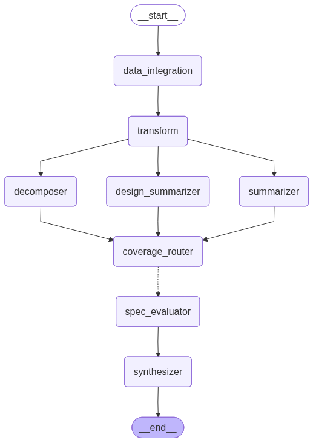

# Test Suite Reviewer (RTM)

QAAI (qaai) · qaai.agents.test_suite_reviewer · endpoint POST /api/v1/test-suite-review · generated from the codebase 2026-07-06

<h2 id="purpose">What it checks &amp; how</h2>

The Test Suite Reviewer answers one regulatory question for a **single requirement**: *does the traced test suite adequately cover this requirement?* It is the Requirements-Traceability-Matrix (RTM) lens used in FDA / IEC 62304 design verification reviews. The graph runs as a binary classifier, emitting an SoP-gating rubric (M1–M5) plus one advisory dimension (R6) and a single Yes/No `overall_verdict`.

It makes its assessment in three movements:

1. **Decompose** the requirement into atomic, individually testable specifications, and **summarize** each traced test case (and any design documents) into a compact, comparable form.
2. **Evaluate coverage** of every decomposed spec in parallel — one LLM call per spec — scoring whether the summarized test suite exercises it.
3. **Synthesize** the per-spec verdicts into one holistic assessment (a Mixture-of-Agents-style reduction) that produces the M1–M5 + R6 findings, comments, and clarification questions.

<h2 id="inputs">Inputs required</h2>

The graph state is `RTMReviewState` test_suite_reviewer/core.py. A run needs, per requirement:

<table>
<thead><tr><th>Field</th><th>Type</th><th>Required</th><th>Meaning</th></tr></thead>
<tbody>
<tr><td><code>requirement</code></td><td><code>Requirement</code> (<code>req_id</code> + <code>text</code>)</td><td>Yes</td><td>The single requirement under review; <code>req_id</code> is the cache partition.</td></tr>
<tr><td><code>test_cases</code></td><td><code>List[TestCase]</code></td><td>Yes</td><td>Test cases traced to the requirement (id, description, setup, steps, expected results).</td></tr>
<tr><td><code>design_docs</code></td><td><code>List[DesignDocument]</code></td><td>Optional</td><td>Design docs implementing the requirement; enables the R6 design-alignment lens.</td></tr>
<tr><td><code>cache_mode</code></td><td><code>"off" | "on" | "test"</code></td><td>Optional</td><td>Per-run cache behaviour; defaults to <code>on</code> (legacy <code>partial</code>→<code>on</code>, <code>full</code>→<code>test</code> still accepted).</td></tr>
</tbody></table>

Via the API, these arrive from a JAMA baseline: the `data_integration` node fetches the baseline and `transform` maps each requirement + its traced test cases into one `RTMReviewState`. In tests the state is supplied directly and both nodes are no-ops.

<h2 id="graph">Graph topology</h2>

<figure>
  
  <figcaption>Compiled <code>RTMReviewerRunnable</code> graph. <em>The ASCII below is authoritative; the rendered PNG is regenerated separately (follow-up).</em></figcaption>
</figure>

<pre class="diagram"><code>START
  -&gt; data_integration            (JAMA fetch, or no-op when data already in state)
  -&gt; transform                   (JAMA rows -&gt; graph state)
  -&gt; validation_gate             (skip the graph -&gt; END when required inputs are missing)
  -&gt; [ decomposer | summarizer | design_summarizer ]   (parallel)
  -&gt; coverage_router             (join barrier)
  -&gt; dispatch_coverage  --Send xN--&gt;  spec_evaluator    (parallel, one per spec)
  -&gt; synthesizer                 (reduces coverage_analysis via operator.add)
  -&gt; END</code></pre>

Decomposer, summarizer and design_summarizer run concurrently; all three land on `coverage_router` (a no-op join) before `dispatch_coverage` fans out one `Send` per decomposed spec. The per-spec verdicts accumulate into `coverage_analysis` via an `Annotated[List[EvaluatedSpec], operator.add]` reducer, which the synthesizer then reduces. test_suite_reviewer/pipeline.py

<h2 id="nodes">Nodes &amp; prompts</h2>

<table>
<thead><tr><th>Node</th><th>Class</th><th>Prompt role</th><th>Does</th><th>Output</th></tr></thead>
<tbody>
<tr><td><code>data_integration</code></td><td><code>DataIntegrationNode</code></td><td>—</td><td>Conditional JAMA fetch (via PyJama) vs. local pass-through.</td><td><code>jama_data</code> or no-op</td></tr>
<tr><td><code>transform</code></td><td>transform fn</td><td>—</td><td>Maps JAMA rows → state (no-op in local mode).</td><td>state fields</td></tr>
<tr><td><code>decomposer</code></td><td><code>DecomposerNode</code></td><td><code>decomposer</code></td><td>Splits the requirement into atomic, testable specs. v6 (edge-case set) adds boundary/concurrency/state-mode/degenerate-input decomposition.</td><td><code>DecomposedRequirement</code></td></tr>
<tr><td><code>summarizer</code></td><td><code>SummaryNode</code> (Batched)</td><td><code>summarizer</code></td><td>Condenses each test case to objective / protocol / acceptance-criteria; batched in parallel.</td><td><code>TestSuite</code></td></tr>
<tr><td><code>design_summarizer</code></td><td><code>DesignSummarizerNode</code> (Batched)</td><td><code>design_summarizer</code></td><td>Summarizes design docs (verification hooks, key components); skips when none.</td><td><code>SummarizedDesignSpec[]</code></td></tr>
<tr><td><code>coverage_router</code></td><td><code>lambda</code></td><td>—</td><td>Join barrier so the conditional fan-out has a single named source.</td><td>—</td></tr>
<tr><td><code>spec_evaluator</code></td><td><code>SingleSpecEvaluatorNode</code></td><td><code>coverage</code></td><td>Scores coverage of <em>one</em> spec against the summarized suite; runs N× in parallel via <code>Send</code>.</td><td><code>EvaluatedSpec</code> (accumulated)</td></tr>
<tr><td><code>synthesizer</code></td><td><code>SynthesizerNode</code> (final)</td><td><code>synthesizer</code></td><td>MoA-style reduction of all per-spec verdicts into the M1–M5 + R6 rubric. <code>is_final_output=True</code>.</td><td><code>SynthesizedAssessment</code></td></tr>
</tbody></table>

<h2 id="rubric">Rubric — M1–M5 (mandatory) + R6 (advisory)</h2>

<table>
<thead><tr><th>Code</th><th>Dimension</th><th>Verdict</th><th>Checks / N-A rule</th></tr></thead>
<tbody>
<tr><td><strong>M1</strong></td><td>Functional coverage</td><td>Yes / No</td><td>The requirement's positive behaviour is covered by ≥1 test case.</td></tr>
<tr><td><strong>M2</strong></td><td>Negative coverage</td><td>Yes / No / N-A</td><td>Error/invalid-input handling is tested. <em>N-A</em> when the requirement has no validation surface.</td></tr>
<tr><td><strong>M3</strong></td><td>Boundary coverage</td><td>Yes / No / N-A</td><td>Limits/thresholds are tested. <em>N-A</em> when the requirement has no threshold/limit surface.</td></tr>
<tr><td><strong>M4</strong></td><td>Spec coverage</td><td>Yes / No</td><td>Every decomposed spec is covered by the suite.</td></tr>
<tr><td><strong>M5</strong></td><td>Terminology alignment</td><td>Yes / No</td><td>Test vocabulary aligns with the requirement text.</td></tr>
<tr><td><strong>R6</strong></td><td>Design alignment <em>(advisory)</em></td><td>Yes / No / N-A</td><td>Design docs implement the requirement. <em>N-A</em> when no design docs exist. Does not gate the verdict.</td></tr>
</tbody></table>

<h2 id="verdict">Verdict logic</h2>

The synthesizer returns exactly six `MandatoryFinding` items (M1–M5 + R6). `overall_verdict` is **Yes** iff every mandatory finding (M1–M5) is in `{Yes, N-A}`; R6 is advisory and never flips the verdict. The assessment also carries up-to-two-sentence `comments` and targeted `clarification_questions`. test_suite_reviewer/core.py

<h2 id="cache">Caching &amp; prompt sets</h2>

Every interim node opts into the shared write-through `ReviewCacheManager` (on disk), partitioned by `req_id`. Under `on` (the default), interim nodes are reused from cache but the final synthesizer always re-runs for a fresh assessment.

<strong>Prompt sets &amp; the edge-case toggle.</strong> The API
field <code>include_edge_case_analysis</code> selects the prompt set:
<code>test_suite_reviewer_v4</code> (edge-case decomposer v6) when ON,
<code>test_suite_reviewer_v3</code> (baseline decomposer v5) when OFF. The two
sets share the same version for every other node, so the <strong>prompt-set name is
folded into the cache key</strong>
(<code>review:{req_id}:{set}:{node}:{version}</code>, disk
<code>{cache_dir}/{req_id}/{set}/{node}_{version}_{timestamp}.json</code>) to keep their
results from aliasing. Each set is pre-compiled into its own graph at startup and selected
per request.

## Output

The endpoint returns a self-contained HTML `FileResponse` (viewer) rendered from `outputs.jsonl`, one record per requirement, showing the M1–M5 + R6 rubric, the decomposed specs, and the inlined test cases.
